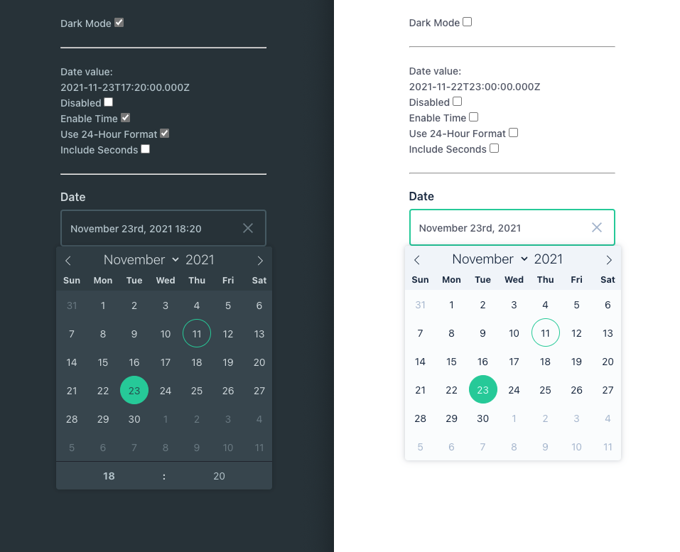

# Date Picker Interface - for Directus 9

Based on the awesome [Flatpickr](https://flatpickr.js.org/) library.



### Configuration

Supports min and max field dates so you can have a `from` and `to` setup.

### Install

 - Install package: `npm install directus-date-picker-interface -S`
 - Create folder: `mkdir extensions/interfaces/date-picker`
 - Create file: `echo "export * as default from 'directus-date-picker-interface'" >> extensions/interfaces/date-picker/index.js`

```javascript
// extensions/interfaces/date-picker/index.js
export * as default from 'directus-date-picker-interface'
```

### Develop

All files in `src/DevComps` are purely for development purposes,
and are not included in the final build

 - `npm install`
 - `npm start`


### Deploy

 - `npm run build`
 - `cp dist PATH_TO_DIRECTUS_PROJECT/extensions/interfaces/date-picker`

### Todo

 - [ ] Implement [Localizations](https://flatpickr.js.org/localization/)